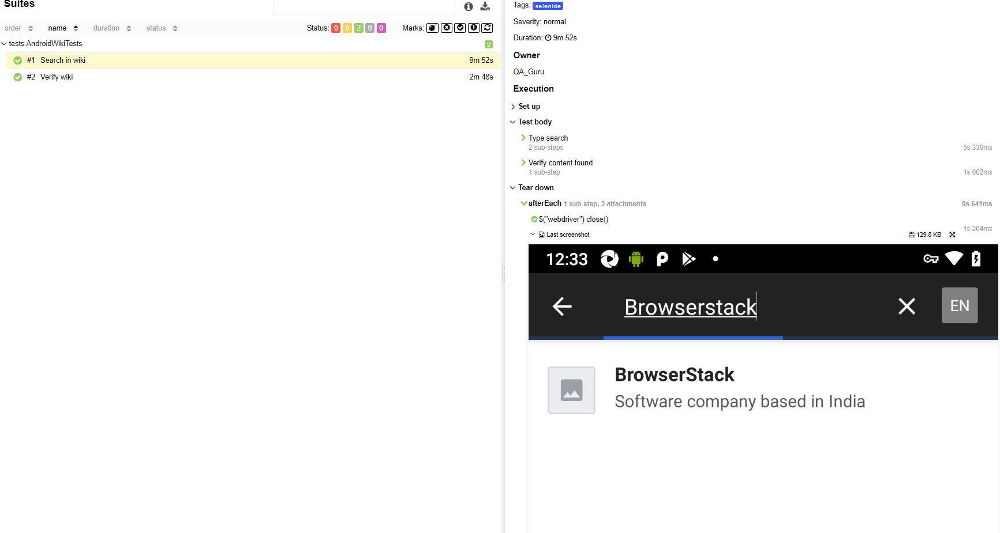
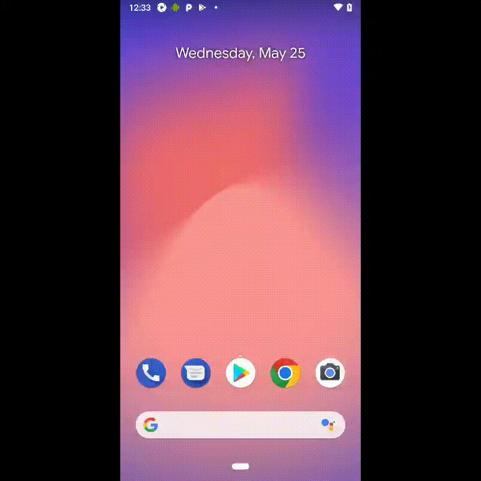

# Проект по автоматизации мобильного UI тестирования приложения Wikipedia

## :scroll: Структура:

- <a href="#toolbox-Стек">Стек</a>
- <a href="#arrow_forward-Автотесты">Автотесты</a>
- <a href="#bar_chart-сборка-в-Jenkins">Сборка в Jenkins</a>
- <a href="#loudspeaker-allure-отчет">Allure отчет</a>
- <a href="#film_strip-видео-примеры-прохождения-тестов">Видео примеры прохождения тестов</a

## :toolbox: Стек:

## :arrow_forward: Автотесты
- Поиск статей в приложении
- Проверка блока новостей

## Сборка в Jenkins
### <a target="_blank" href="https://jenkins.autotests.cloud/job/QA_guru_11_Mobile_Diploma/">Сборка в Jenkins</a>

## Allure отчет
- ### Главный экран отчета

- ### Страница с проведенными тестами

## Тесты кейсы в Allure Test Ops

## Видео примеры прохождения тестов
> К каждому тесту в отчете прилагается видео. Одно из таких видео представлено ниже.

  

